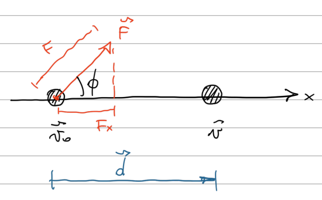
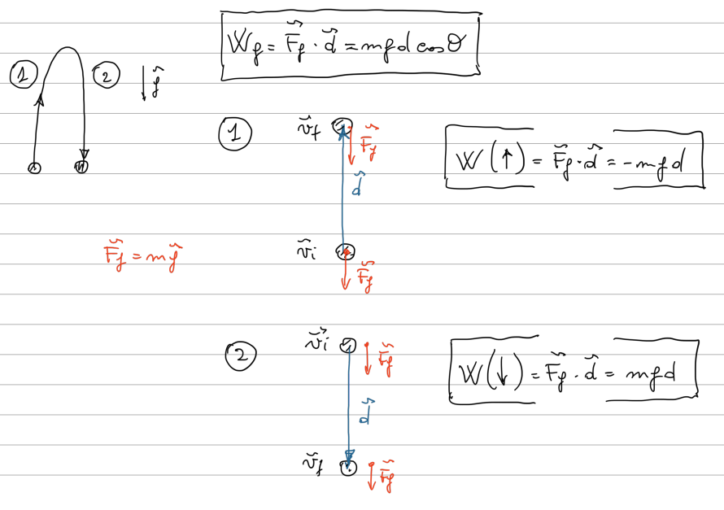
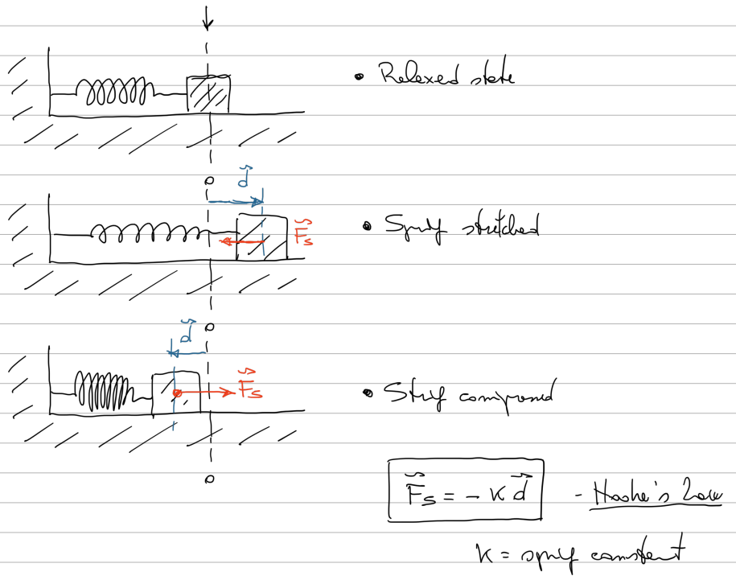
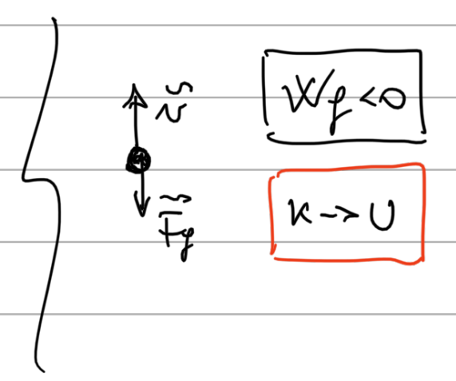
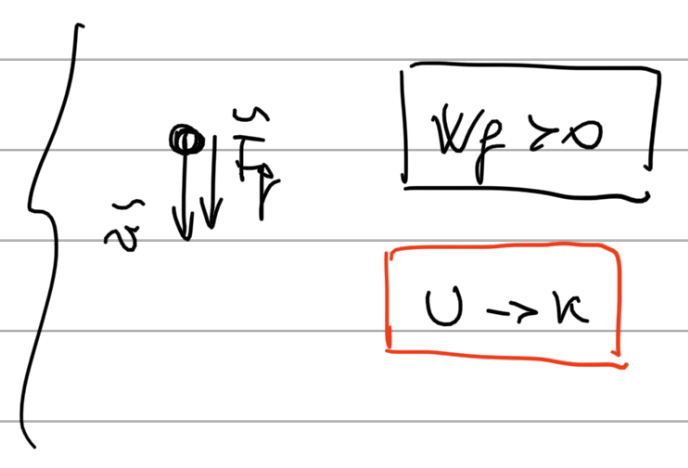
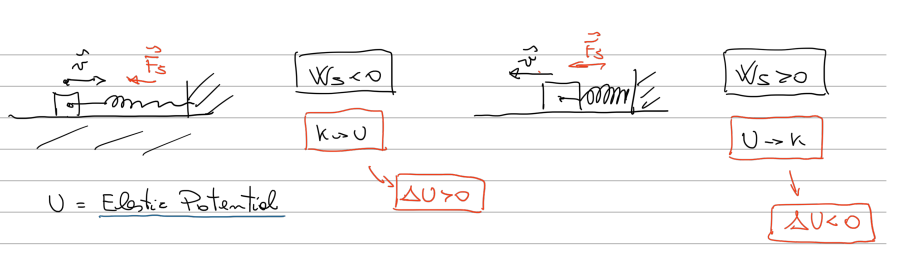
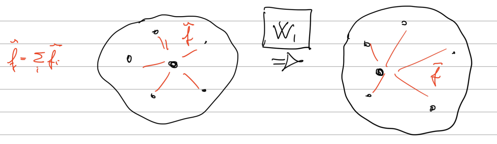
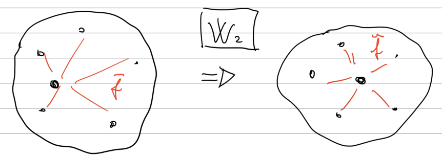

## Kinetic Energy:
Kinetic energy is the energy associated with the state of motion of an object.
The faster it moves, the greater is its kinetic energy.

> The unit of measurement is **Joule**: `1 kg • m²/s²`.  
> Formula: `K = 1/2 mv²`.

_(Just a scalar quantity/number associated to the motion)._

> Kinetic energy is an expression of the fact that a moving object can do work on anything it hits;  
> it quantifies the amount of work the object could do as a result of its motion.

---

## Work:
Work is the energy transferred to or from an object, when a force is applied to the said object.  
> Positive work = Energy is transferred to the object.  
> Negative work = Energy is transferred from the object.

> The unit of measurement is Joule.  
> Formula: `W = F • d`.

_(Work is done on an object by a force)._

If you step in front of a full speed truck, it will do work on you, and it will not be pleasant.

### Demonstration for Work formula:
An object is moved through a wire by a constant force(constant acc.), and has a displacement d.  
Only Fx does work, because the object can't move vertically.

By using the formula:  
`v² = v₀ + 2a•d`  
and getting the acceleration from the force:  
`a = F/m` → `v² = v₀² + (2•F•d)/m`  
we obtain:  
`1/2 mv² - 1/2 mv₀² = F • d`
 
And we can notice that `1/2 mv²` is exactly the formula of kinetic energy, so `1/2 mv² - 1/2 mv₀²` is basically a difference in kinetic energy, the definition of **Work**.
 
>`W = F • d` = Force • Displacement

### Work done by a gravitational force:

We calculate separately the work done with upwards displacement and downwards displacement.  
**We use a component of the Gravitational Force** as the force in the Work formula.

> θ is the angle in between the force and the direction.
> In the upwards section, θ == 180º, so cos(180º) = -1, that's why the work is negative.
> 
> In the downards section, θ == 0º, and cos(0º) = 1, hence the positive work.
> 
> 

### Work done by a spring force:

> **Hooke's law:**  
> The force from a spring is: `F = -k • d`.  
> _d_ is the displacement of the spring's end from where it was in the relaxed state.  
> _k_ is the spring constant, a measurement of the spring stiffness.

INTEGRALI NON CI CAPISCO UN CAZZO PASSO AVANTI.

### Work done by a general variable force:
INTEGRALI NON CI CAPISCO UN CAZZO PASSO AVANTI.

---

## Power:
It's the rate at which the work is done by a force.
> Pavg = `W/∆t` → Average power  
> P = `dW/d∆t` → Instantaneous power = `F • v` ???  
> Unit of measurement = Joule/s  
> 
cosa cazzo devo derivare me lo vuoi spiegare?
> Appena mi arriva una legge che descrive l'andamento del lavoro, lo derivo e mi ritrovo la derivata prima, che quindi è la legge che descrive l'andamento del power. CREDO.
---

## Potential Energy and Conservation of Energy:

> **Potential energy:**  
> Energy associated with the arrangement of a system of objects that exert forces on one another.

When we throw an object in the air, the gravitational force does negative work on the object, slowing it down until it stops.  
But if the work is negative, then the Force is transferring the kinetic energy to somewhere else, in this case the gravitational potential energy of the object, or Earth system.  
  
Then the object begins to fall again, the work is positive and the gravitational force is transferring the energy from the potential energy back to the object.  

`∆U = -W` → `∆U = -∆K`

da commentare

---

### Conservative vs non-conservative forces:

>In a situation in which:
>1) The system has two or more objects;
>2) A force acts between an object in the system and the rest of the system;
>3) If the system changes configuration, the force does W₁ on the object.  
>
>4) If the system reverses into the initial configuration, f does W₂.  
>
>
>The force is conservative if W₁ = -W₂, in this case the other type of energy is the potential energy.  
>If this isn't the case, the force is called non-conservative(frictional force and drag force for example).

### Path Independence of Conservative Forces:

Non iasmdimasdimasdsdmfnjhdfghjfdgbfjghbgjdfhbgdfg.
