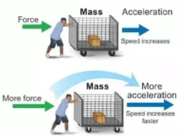

## Newton Laws:
> **Newton 1st Law:**  
> An object will not change its motion unless acted on by an unbalanced force.
> - If it is at rest it will remain at rest
> - If it is in motion, it will retain the same velocity.
> 
> 

> **Newton 2nd Law:**  
> Objects have a property called inertia, which makes them resist to change in motion.  
> Forces can overcome this inertia to produce acceleration.
> 
> The acceleration of an object is directly proportional to the magnitude of the force applied, and inversely proportional to the mass of the object.
> 
> `a = F / a` or `F = m • a`
> 
> More force = More acceleration;  
> More mass = More inertia = Less acceleration/More force needed.
> 
> 
> 

> **Newton 3rd Law:**  
> For every action, there is an equal and opposite reaction.
>   
> 

---

## Gravitational Force:
According to Newton's IInd Law(`F = m•a`) we can describe the gravitational force as `F = m•g`.  
- g = gravitational acceleration(`9,81 m/s²`);  
- m = mass.

We can also call this **weight**.

> There is also something about weight, that I'm not getting, it appears to be the same thing.
> 

## Normal Force:
Force that pushes the surface of an object away from another one's.  
- The direction is perpendicular to the surface;
- The magnitude is equal to the force that pushes the object onto the surface.

`Fn - Fg = m • a` ← 0

 

## Friction:
Force that opposes motion along two surfaces in contact.  

> ### Properties:
> 1) Body doesn't move → `ƒs = -F`;
> 2) `ƒs(max) = μs • Fn` (μs = static friction coeff.);
> 3) Body moves → `ƒk = μk • Fn` (μk = kinetic friction coeff.);

## Tension:
Force applied by long thing stretched objects, such as wires or ropes.  
**At each end are applied forces that are equal in magnitude.**

Please look at problems involving tension forces.
