# Chapter III - Vectors

---

> ### Scalar quantity:  
> Quantity involving only magnitude.

> ### Vector:  
> Quantity involving magnitude and direction.  
 The magnitude of a vector is its strength.  
 The length of a vector is its magnitude.
> 
>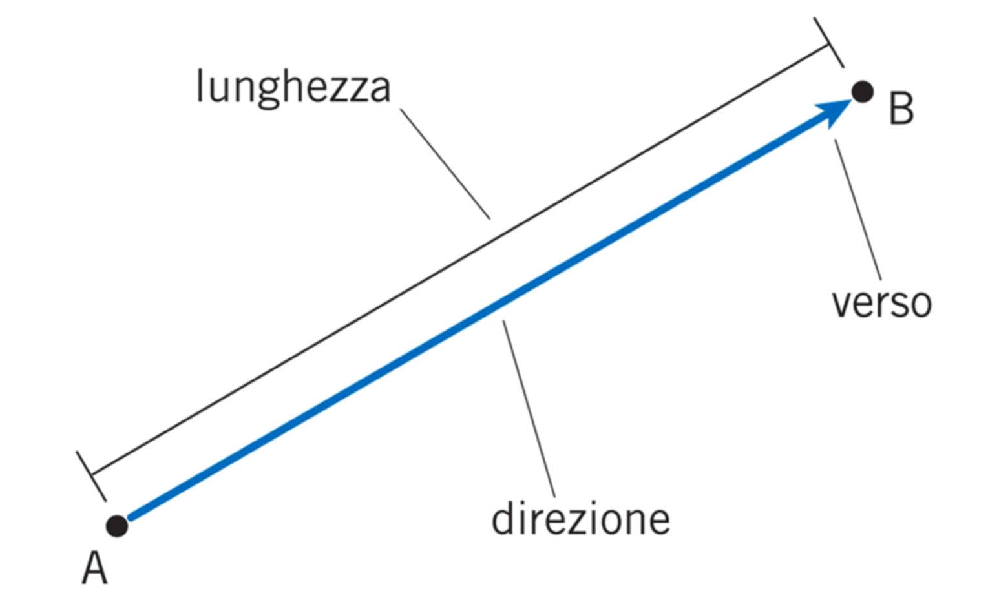
---

## Adding vectors:  
There are two methods of adding Vectors:  

- >"punta-coda" method:  
  >
  > 
- > "parallelogramma" method: 
  > 
  > 

The math behind the operations on vectors follows these two rules:

- Commutative law:  

- Distributive law  
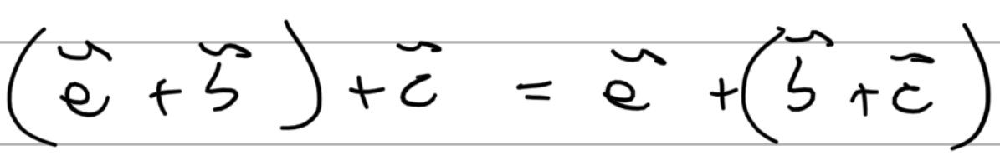  

---

## Subtracting vectors:  

Subtracting a vector from itself just equals 0 :  
v1 - v1 = 0

A vector with the negative sign is just going in the opposite direction.  
Subtracting a vectors works like adding vectors.

---

## Components of Vectors:  

> ### The real deal:  
>a = vector  
θ = angle of the components  
ax, ay = x component, y component
>
>  
>
>A better representation of the components:  
>
>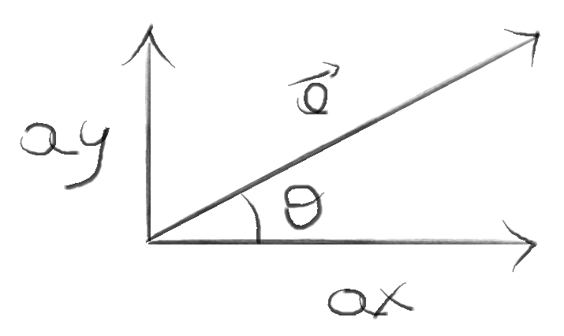  

No explanations needed for this.

### Formula:  

> ### Notation:  
> _(ax, ay)_ - Component Notation  
 _(a, θ)_ - Magnitude-Angle notation

---

## Unit Vector:  

>A unit vector is a vector with a magnitude of 1 and a specific direction.  
> 

### Adding vectors:  

### wtf is this?  

### Multiply by a scalar:  
You just multiply the vector.  
2V means that the magnitude has doubled.

---

## Scalar product:  

Definition taken from [this video](https://www.youtube.com/watch?v=UiV4UQRAUeo):  
The scalar product of two vectors, gives back a scalar value.

> **A × B** = magnitude of A × magnitude of (projection of B on A's direction)

> The projection of B can be calculated using this formula: _B cos θ_

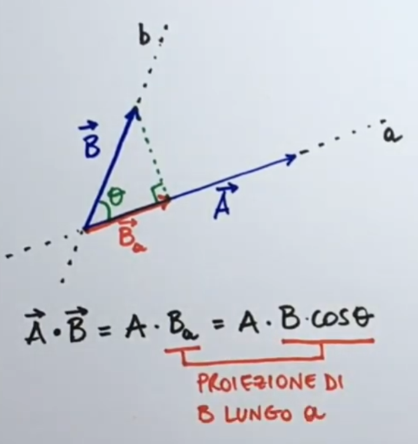

### Properties:  

- It follows commutative law, meaning that we can swap vector a and b and nothing will change.  
  
- It follows distributivity law, meaning that I don't know what it means.
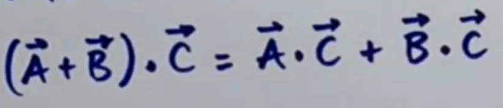

---

## Vector product  
> Magnitude of result:  
> 
> 
> Direction of result:  
> Perpendicular to the plain that contains the two vectors

---

### Unit vector notation for Scalar Product:  
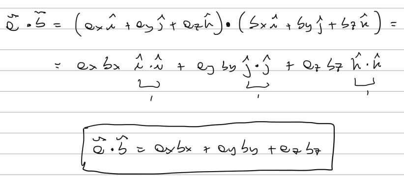

### Unit vector notation for Vector Product:  
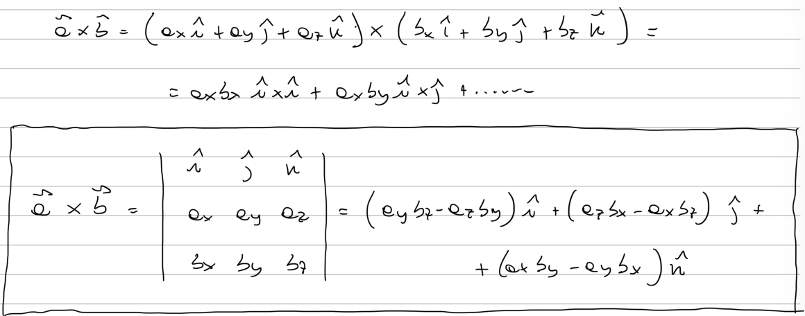

---

# 3D VECTORS

---
## Position Vector:

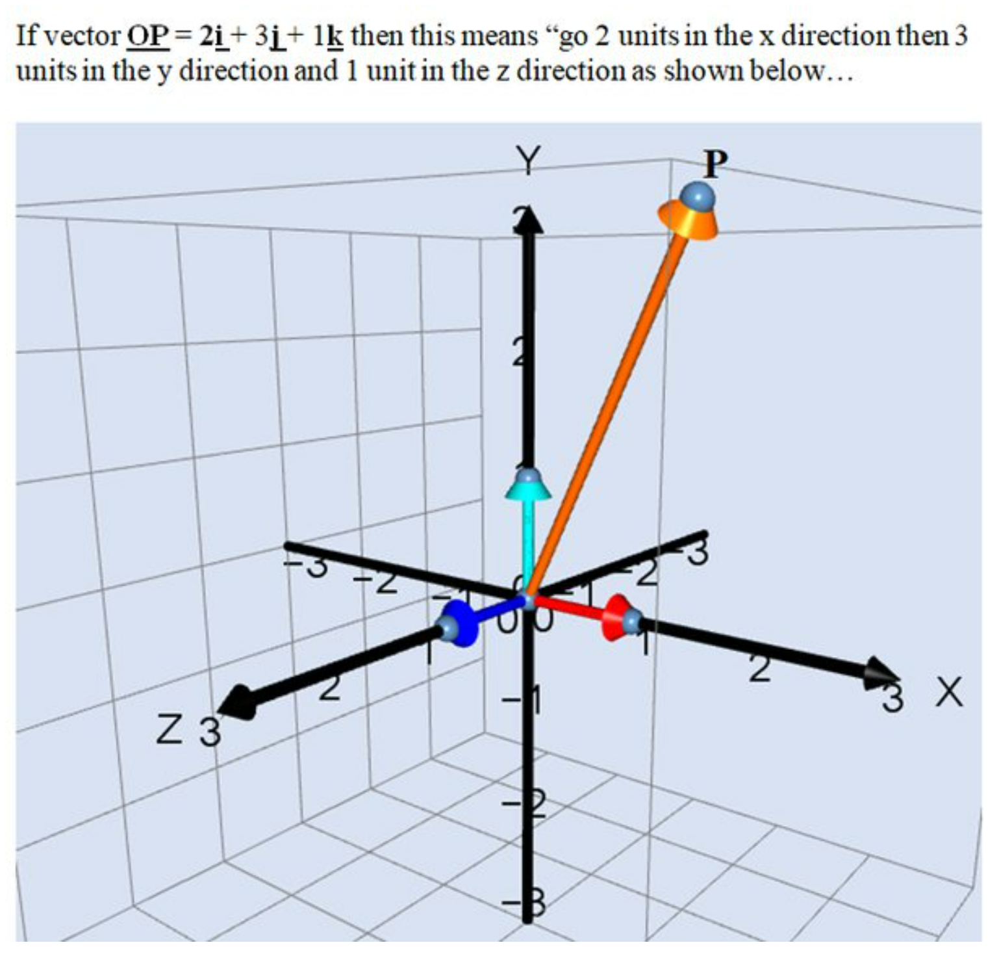

Basically we consider i, j and k as unit vectors, and to define a vector, we multiply numbers to them, thus modifying their magnitude.

### To add vectors using this notation, we just:  
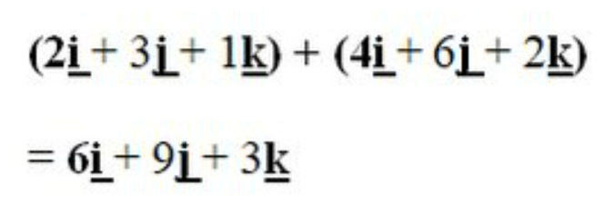

> So the position vector is just us multiplying the unit vectors on the 3 axes by a scalar number, making the magnitude bigger(or smaller).

---

## Displacement Vector:

> I's a vector resulting from the difference between two vectors.  
> 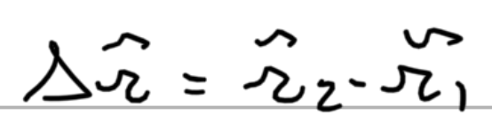

Basically we just subtract the scalar values to their corresponding value on the other vector:

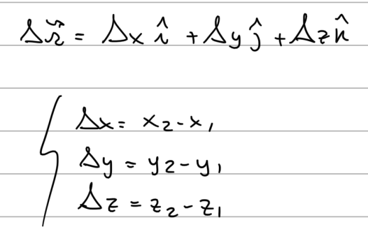

> Graphic representation of the resulting vector:
> 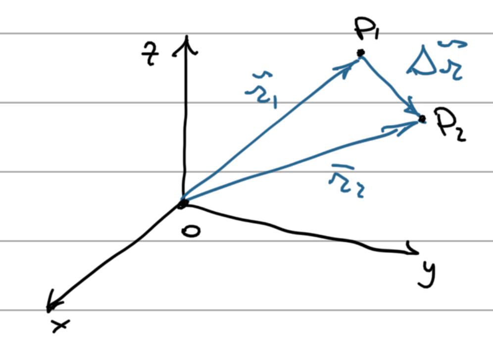

---

## Average Velocity:

---

## Instantaneous Velocity:

---

## Average Acceleration:

---

## Instantaneous Acceleration:
